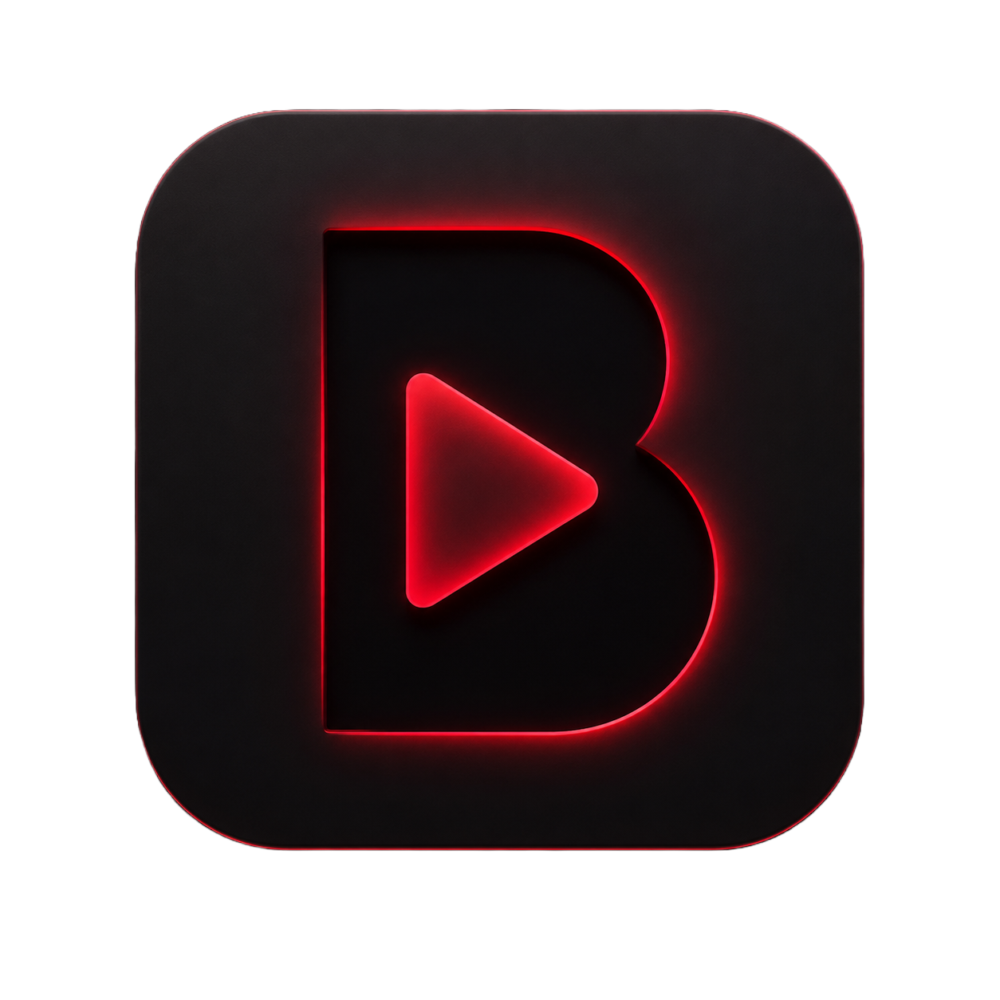
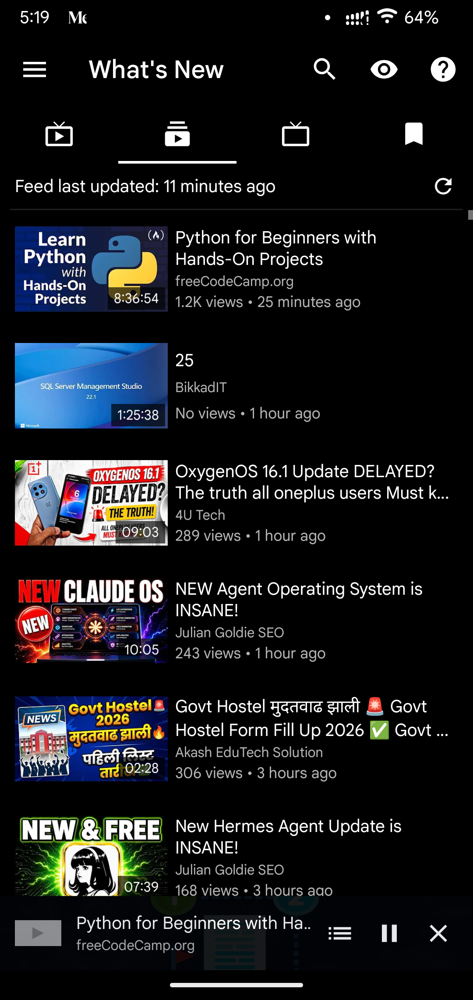
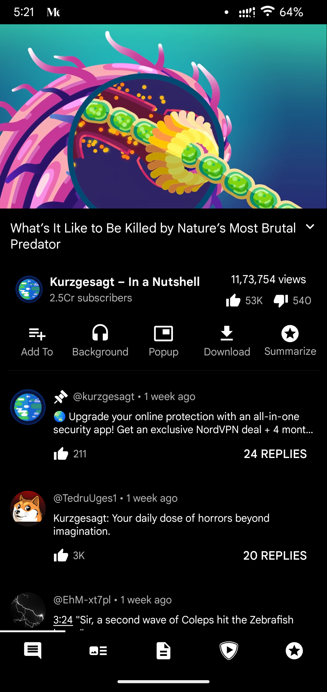
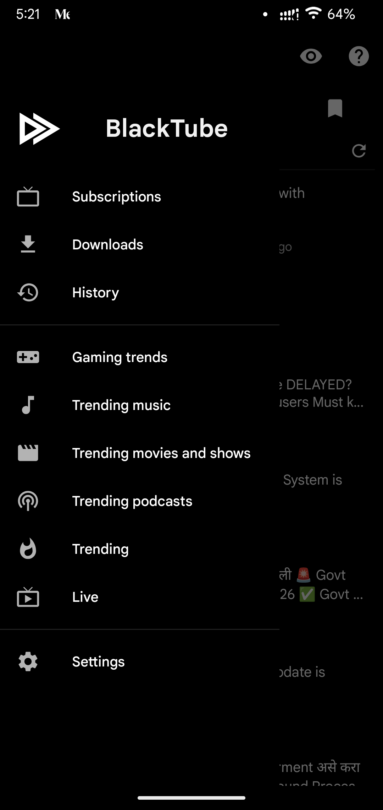
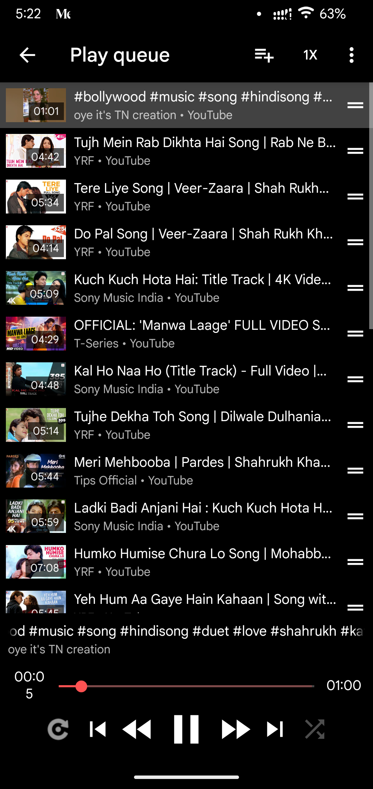
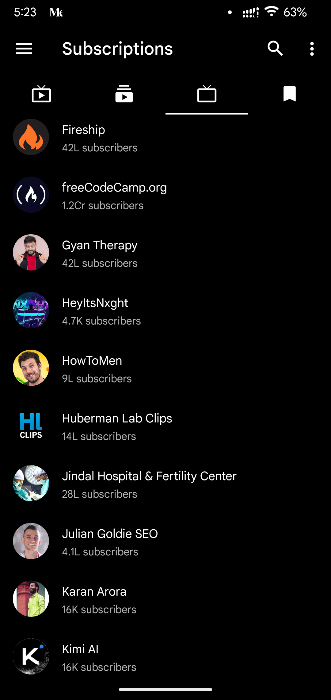
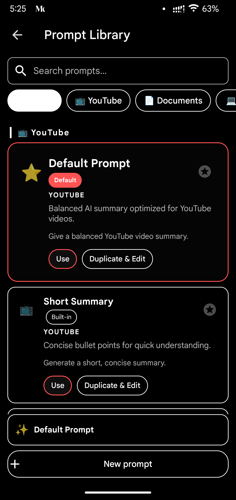
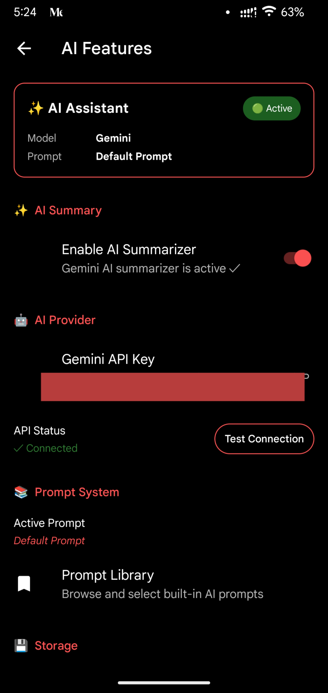

<div align="center">
  <picture>
    
  </picture>

  <h1>BlackTube</h1>

  <p><b>A privacy-respecting YouTube client with AI-powered video summaries.</b></p>

  <p>
    <a href="https://github.com/TeamNewPipe/NewPipe/blob/dev/LICENSE"></a>
    
    
  </p>
</div>

## Screenshots

<div align="center">
  
  
  
  
  
  
  
  
</div>

## Overview

BlackTube is a fork of [NewPipe](https://github.com/TeamNewPipe/NewPipe) focused on a YouTube-first experience with optional AI features. Core extraction, streaming, subscriptions, background playback, and privacy-first behavior come from the NewPipe ecosystem. BlackTube adds bring-your-own-key AI summaries, prompt management, and app-specific defaults.

## Features

### AI Summary

- Bring your own Gemini API key. No developer-owned key is bundled with the app.
- Generate summaries from video metadata and transcript content when available.
- Cache summaries locally to save API usage and make repeated views faster.
- Render readable Markdown summaries in the video detail view.
- Select a custom prompt from the built-in Prompt Library.

### Prompt Library

- Browse built-in prompt styles for different summary formats.
- Activate a prompt and reuse it across summaries.
- Duplicate and edit prompts for custom workflows.
- Return to the default prompt at any time.

### YouTube-First Experience

- BlackTube currently forces YouTube as the selected streaming service.
- SponsorBlock and Return YouTube Dislike integrations are retained.
- Playback, downloads, subscriptions, and background audio are inherited from NewPipe.

### Local Extractor Development

This branch is configured to use a local `NewPipeExtractor` included build:

```kotlin
includeBuild("./NewPipeExtractor")
```

That lets the app build against local extractor changes instead of relying only on the published JitPack artifact.

## Privacy

BlackTube follows the same privacy posture as NewPipe: no ads, no analytics, and no tracking added by the app.

AI summaries are optional. If you enable them, requests are sent to Google's Gemini API using the API key you provide. BlackTube does not ship with an API key and does not route AI requests through a BlackTube server.

## Installation

### GitHub Releases

Prebuilt APKs are intended to be published on the [Releases page](https://github.com/rsshir60/BlackTube/releases).

### Build From Source

Requirements:

- Android SDK
- JDK 17
- A local `NewPipeExtractor` checkout at `./NewPipeExtractor`

```bash
git clone https://github.com/rsshir60/BlackTube.git
cd BlackTube
./gradlew assembleRelease
```

The release APK is generated under:

```text
app/build/outputs/apk/release/
```

## Tech Stack

- Kotlin and Java
- AndroidX, Material Components, and Android preferences
- AndroidX Media3
- Gemini Generative AI SDK
- Markwon for Markdown rendering
- RxJava, Room, OkHttp, Coil, and Jsoup
- NewPipe Extractor via local included build

## Roadmap

- Keep syncing with upstream NewPipe where practical.
- Continue improving the prompt library and custom prompt editor.
- Document release signing and distribution once release automation is finalized.

## Contributing

Contributions are welcome. For changes to core extraction or playback behavior, consider whether the patch belongs upstream in NewPipe or NewPipe Extractor first.

## License And Credits

BlackTube is licensed under the GNU General Public License v3.0 or later.

```text
Copyright (C) 2025 NewPipe e.V. and BlackTube Contributors

This program is free software: you can redistribute it and/or modify
it under the terms of the GNU General Public License as published by
the Free Software Foundation, either version 3 of the License, or
(at your option) any later version.
```

Special thanks to the [NewPipe Team](https://github.com/TeamNewPipe/NewPipe) for the original codebase.
