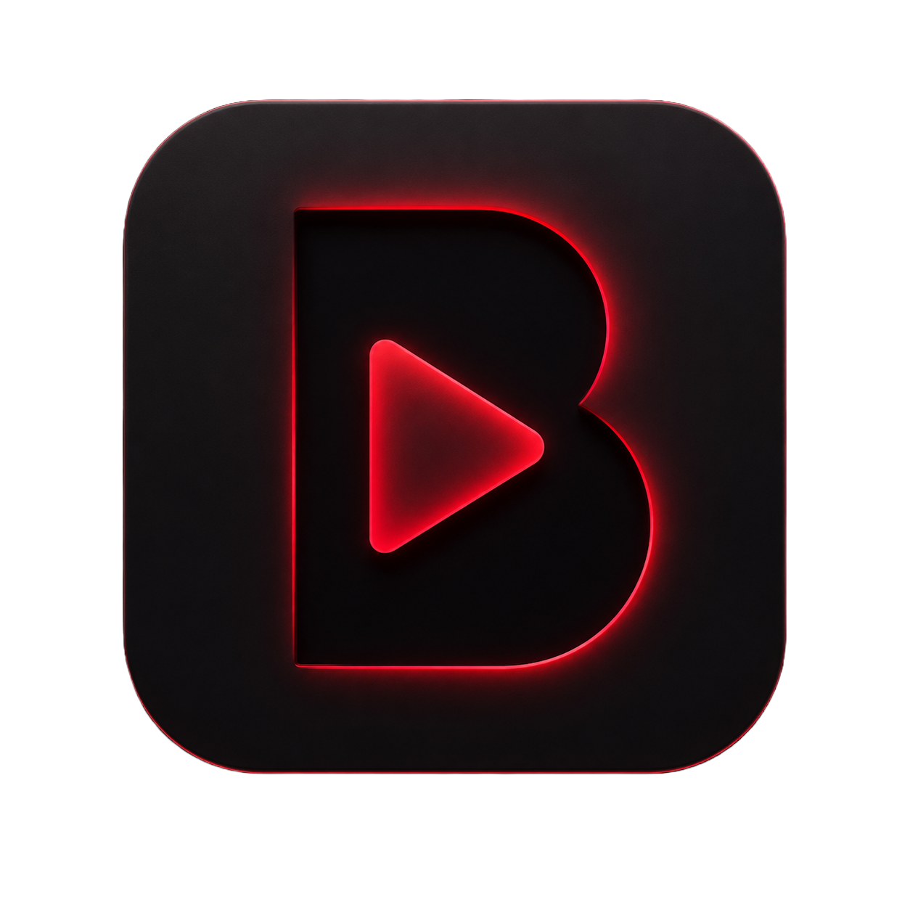
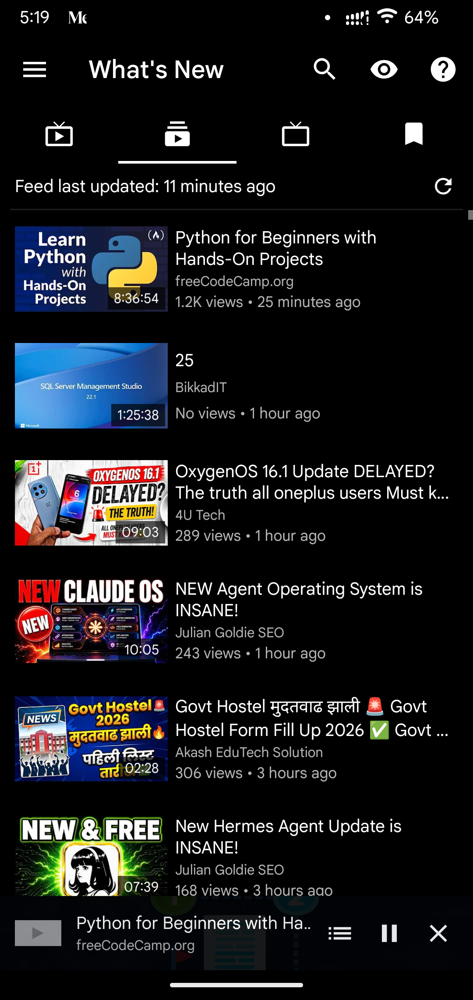
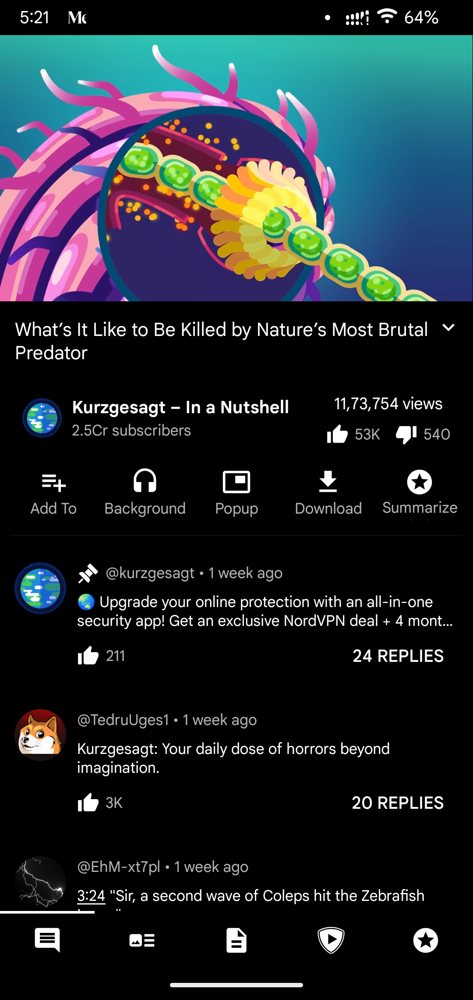
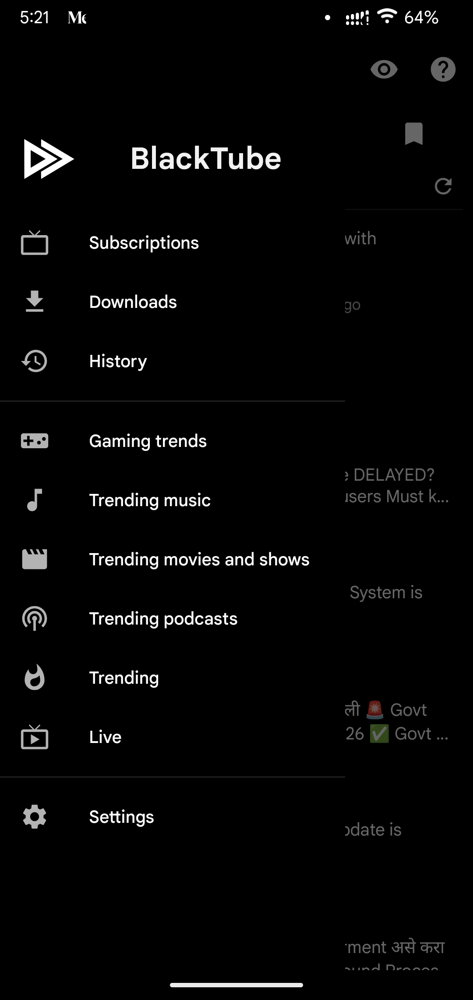
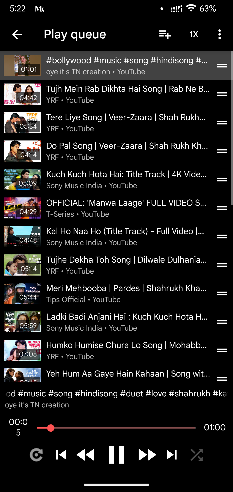
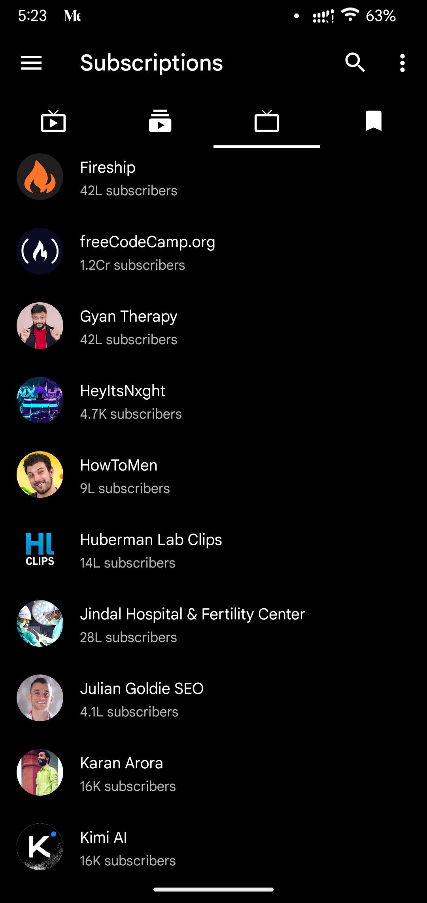
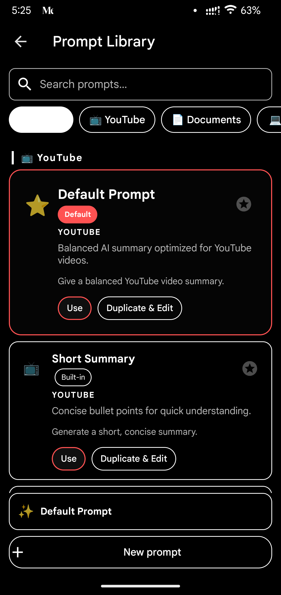
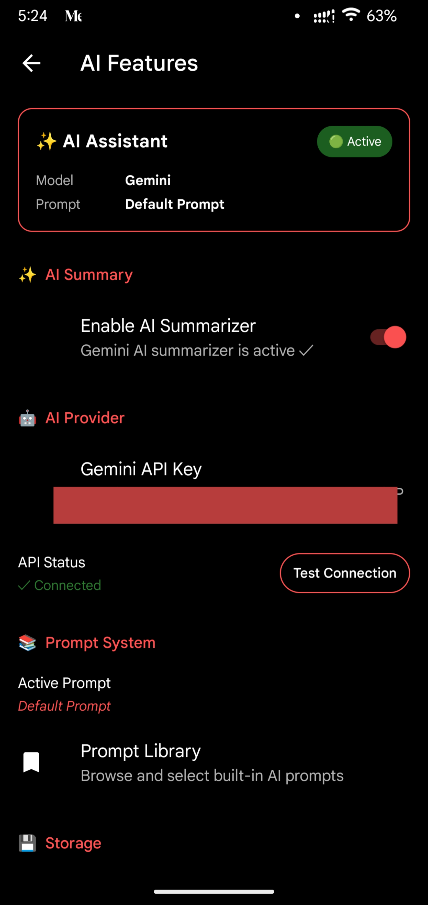

<div align="center">
  <picture>
    
  </picture>

  <h1>BlackTube v1.1.0</h1>

  <p><b>A privacy-first YouTube client powered by On-Device Local AI (Phi-4 Mini) & Cloud Gemini.</b></p>

  <p>
    <a href="https://github.com/TeamNewPipe/NewPipe/blob/dev/LICENSE"></a>
    
    
    
    
  </p>
</div>

## Screenshots

<div align="center">
  
  
  
  
  
  
  
  
</div>

## Overview

BlackTube is a high-performance fork of [NewPipe](https://github.com/TeamNewPipe/NewPipe) focused on a YouTube-first experience with advanced on-device and cloud AI features. Core extraction, streaming, subscriptions, background playback, and zero-tracking privacy come from the NewPipe ecosystem. 

BlackTube adds **On-Device Local AI (Phi-4 Mini 3.8B)**, **Bring-Your-Own-Key Cloud Gemini**, **Interactive Talk-to-Video Q&A**, **Executive PDF Exports**, and a customizable **Prompt Library**.

## Key Features

### 🔒 Dual AI Engine Suite

- **On-Device Local AI Engine (Microsoft Phi-4 Mini 3.8B)**: Runs 100% offline via native C++ NDK GGUF inference (`llama.cpp`). Zero cloud data transmission, complete airplane-mode privacy.
- **Cloud Gemini Engine**: Bring-your-own-key Google Gemini 3.1 Flash-Lite API integration for instant cloud synthesis.
- **Universal Engine Provider Selector**: Switch seamlessly between *Local AI*, *Cloud Gemini*, or *Auto-Select* via Settings or 1-tap in-fragment chip menu.

### 🎯 User-Controlled Summaries & Prompt Library

- **User-Controlled Generation**: Zero intrusive auto-summarization on video load. Pick your prompt style and engine provider first, then tap **[ ✨ Summarize Video with AI ]** on your command.
- **Prompt Library**: Browse built-in prompt templates (*Executive Summary*, *TL;DR Bullets*, *Key Takeaways*, *Deep Technical Analysis*, *ELI5 Explanation*).
- **Auto-Re-Generation**: Tapping **Use** on any prompt automatically returns to the summary sheet and re-generates the report under the new style.

### 💬 Talk-to-Video Interactive Q&A (Ask ➔)

- Always-accessible Q&A bar allows asking custom questions about any video's content, transcript, or description 24/7.
- Supports physical keyboard send and soft keyboard `IME_ACTION_SEND` triggers.

### 📄 Executive AI Summary Export Suite

- **Executive PDF Exporter**: Export summaries as structured PDF reports featuring the official App Logo, red accent header divider, video metadata card, stripped raw markdown symbols, custom red bullet dots, and multi-page pagination.
- **Markdown (.md) & Text (.txt) Exports**: Export raw summaries directly to the Downloads folder.
- **System MediaScanner Provider Integration**: All exported PDF, MD, and TXT files are automatically indexed into Android's Downloads provider for instant visibility in system and in-app Downloads tabs.
- **Clipboard Copy System**: 1-tap **Copy Summary** with tactile spring haptics and toast confirmation.

### 📺 YouTube-First Experience

- YouTube service locked as default with SponsorBlock & Return YouTube Dislike integrations.
- Background audio playback, notification media controls, picture-in-picture mode, and video downloads inherited from NewPipe.
- ExoPlayer hardware video codec buffer ownership fallback fix for Qualcomm Snapdragon and Samsung devices.

## Build From Source

Requirements:
- Android SDK (API 34)
- JDK 17
- CMake 3.22+ and Android NDK 27+ for native C++ GGUF inference
- A local `NewPipeExtractor` checkout at `./NewPipeExtractor`

```bash
git clone https://github.com/rsshir60/BlackTube.git
cd BlackTube
./gradlew assembleRelease
```

The signed release package will be located at:

```text
app/build/outputs/apk/release/app-release-signed-v1.1.apk
```

## Tech Stack

- **Core**: Kotlin & Java, AndroidX Media3, Material Design 3
- **Local AI**: C++ NDK, `llama.cpp` JNI, Microsoft Phi-4 Mini 3.8B GGUF Q4_K_M
- **Cloud AI**: Google Gemini Generative AI SDK
- **Markdown & PDF**: Markwon, Android `PdfDocument` & `Canvas` API
- **Extractor**: NewPipe Extractor via local included build

## License And Credits

BlackTube is licensed under the GNU General Public License v3.0 or later.

```text
Copyright (C) 2026 NewPipe e.V. and BlackTube Contributors

This program is free software: you can redistribute it and/or modify
it under the terms of the GNU General Public License as published by
the Free Software Foundation, either version 3 of the License, or
(at your option) any later version.
```

Special thanks to the [NewPipe Team](https://github.com/TeamNewPipe/NewPipe) for the original codebase.
